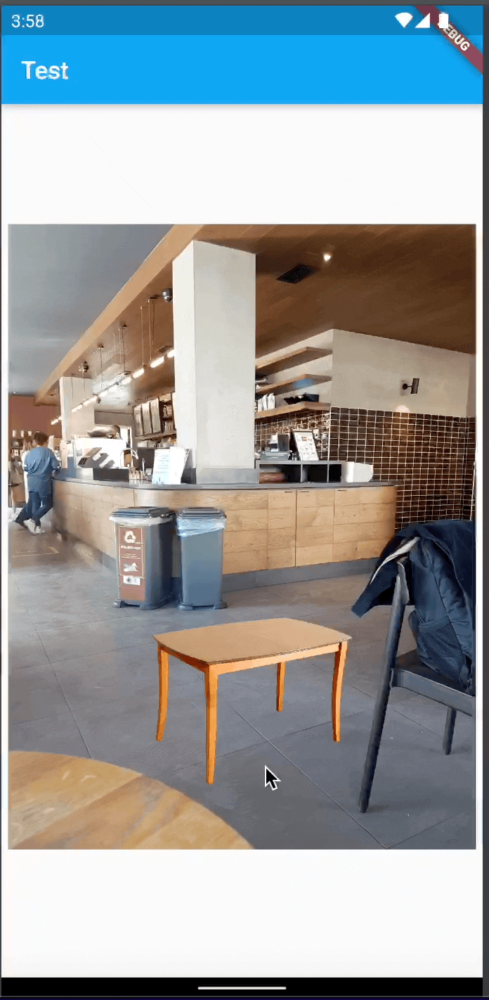

# BC Image Editor
You can edit image using this package and also you can create flex preview image by setting foreground to null. For now, you can use only asset files.

## Features

- Background and Foreground(optional) image
- Resize images
- Set x,y position them
- 3D rotate image image on x, y axis (Foreground only)
- 2D rotate foreground image
- Scale for detail view
- Use on device files or asset files
- Edit foreground image with gesture detector moves.
  - Size and position.
  - 3D rotate Horizontal and Vertical
  - 2D rotate
  - View mode (Scale)


## Getting started
Import: 
```dart
    import 'package:bc_image_editor/bc_image_editor.dart';
```
Using:
```dart
    BcImageEditor(
            frontImage: "image/path",
            bgImage: "image/path",
            frontWidth: 200,
            frontHeight: 300,
            bgWidth: 300,
            bgHeight: 200, //If one of variable of width and height not setted or set to null, the other one will auto scale
            frontLeft: 10,
            frontTop: 10,
            bgLeft: 10,
            bgTop: 10,
            frontBoxFit: BoxFit.fill,
            bgBoxFit: BoxFit.fill,
            rotateX: 0, //rotateX and y are on 3D axis
            rotateY: 0,
            rotate2D: 0,
        ),
```
---
<br /> 

## Edit image with gesture detector
Import: 
```dart
    import 'package:bc_image_editor/edit_with_gesture.dart';
```
Using:
```dart
    EditWithGesture(
      frontImage: frontFilePath,
      bgImage: bgFilePath,
      editMode: EditMode.verticalRotate,
    );
```

Gesture Editing Modes:
| Editing Mode     | Function                                                  |
|------------------|-----------------------------------------------------------|
| size             | Resize and change position image.                                             |
| horizontalRotate | Rotate image horizontal on 3D axis.                       |
| verticalRotate   | Rotate image vertical on 3D axis.                         |
| rotate2D         | 2D rotation.                                              |
| viewMode         | Zoom image for detail things (it doesn't do any editing). |
| noEdit           | Close the editing.                                        |


---
## Using from asset folder image
<br /> 

First initialize your path name:
```dart
    String imagePath = "";
```
Then create a async function like below and use it in initState:
```dart
    void initFiles() async {
        File tempImg =
            await getImageFileFromAssets("assets/image/path");
        setState(() {
            imagePath = tempImg.path;
        });
  }
```
## Example
For example; you wanna edit image with gesture detector and use image from asset file.

Import edit_with_gesture file
```dart

import 'package:bc_image_editor/bc_image_editor.dart';
import 'package:bc_image_editor/edit_with_gesture.dart';
    
``` 

Create file paths as variables:

```dart 
String frontFilePath = "", bgFilePath = "";
```
Create a async variable to get image files. And get images from asset with "getImageFileFromAssets" function. (If you want use device image you can write path directly).

```dart
void initFiles() async {
    File frontTempFile =
        await getImageFileFromAssets("assets/images/example-front.png");
    File tempFileBg = await getImageFileFromAssets("assets/images/example-bg.jpg");
    setState(() {
        frontFilePath = frontTempFile.path;
        bgFilePath = tempFileBg.path;
    });
}
```

Use this function on initState:

```dart
@override
void initState() {
// TODO: implement initState
    super.initState();
    initFiles();
}
```

Use EditWithGesture widget:
```dart
EditWithGesture(
    frontImage: frontFilePath,
    bgImage: bgFilePath,
    editMode: EditMode.verticalRotate,
);
```

Edit With Gesture Detector Examples:

```dart
EditMode.size
```


```dart
EditMode.horizontalRotate
```


```dart
EditMode.verticalRotate
```



```dart
EditMode.rotate2D

```


```dart
EditMode.viewMode
```


Full Code:
```dart 
import 'dart:io';

import 'package:flutter/material.dart';
import 'package:bc_image_editor/bc_image_editor.dart';
import 'package:bc_image_editor/edit_with_gesture.dart';

void main() {
  runApp(const MyApp());
}

class MyApp extends StatelessWidget {
  const MyApp({Key? key}) : super(key: key);

  @override
  Widget build(BuildContext context) {
    return MaterialApp(
      title: 'Flutter Demo',
      home: Scaffold(
        appBar: AppBar(
          title: const Text("Test"),
        ),
        body: const Home(),
      ),
    );
  }
}

class Home extends StatefulWidget {
  const Home({Key? key}) : super(key: key);

  @override
  _HomeState createState() => _HomeState();
}

class _HomeState extends State<Home> {
  String frontFilePath = "", bgFilePath = "";

  void initFiles() async {
    File frontTempFile =
        await getImageFileFromAssets("assets/images/char-2.png");
    File tempFileBg = await getImageFileFromAssets("assets/images/bg-2.jpg");
    setState(() {
      frontFilePath = frontTempFile.path;
      bgFilePath = tempFileBg.path;
    });
  }

  @override
  void initState() {
    super.initState();
    initFiles();
  }

  @override
  Widget build(BuildContext context) {
    return EditWithGesture(
      frontImage: frontFilePath,
      bgImage: bgFilePath,
      editMode: EditMode.verticalRotate,
    );
  }
}

```

# LICENSE
MIT License
